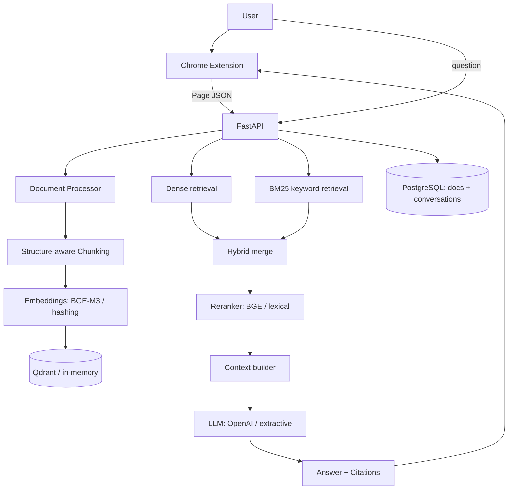

# shawwn — Webpage RAG Assistant

**shawwn** turns any webpage into a grounded question-answering experience. The
existing **PageContext** Chrome extension extracts the current page into clean
structured content; the **shawwn backend** indexes it into a vector store and
answers questions using hybrid retrieval, reranking and an LLM — always citing
the source sections and never inventing facts.

```
Webpage → Extension → Page JSON → FastAPI → Chunking → Embeddings → Qdrant
        → BM25 + Dense (Hybrid) → Reranker → Context → LLM → Answer + Citations → Chat UI
```

---

## 1. Overview

- Open any webpage, click **Ask shawwn**, and chat about that page.
- Answers are grounded strictly in retrieved page content. If the page does not
  contain the answer, shawwn says so instead of guessing.
- Every answer includes citations (section + snippet) with a **View on page**
  button that scrolls to and highlights the source.
- The backend runs in two modes:
  - **light mode** (default): deterministic, offline fallbacks — no model
    downloads or external services. Great for development, CI and the test suite.
  - **full mode**: real BGE-M3 embeddings, Qdrant, BGE reranker and OpenAI.

## 2. Architecture



**Document isolation:** every retrieval is filtered by `document_id`, so
questions about the current page never pull chunks from other pages.

## 3. Tech stack

| Layer | Technology |
|---|---|
| Extension | Manifest V3, vanilla JS/HTML/CSS (no framework) |
| API | FastAPI, Pydantic v2, Uvicorn |
| Embeddings | BGE-M3 (`sentence-transformers`) with a deterministic hashing fallback |
| Vector DB | Qdrant with an in-memory fallback |
| Keyword search | Built-in BM25 (dependency-free) |
| Reranker | BGE cross-encoder with a lexical fallback |
| LLM | Google Gemini (multimodal) or OpenAI via a provider abstraction (+ offline extractive provider) |
| App DB | PostgreSQL (asyncpg) / SQLite for local dev |
| Cache / rate limit | Redis (extension point) + in-memory limiter |
| Infra | Docker, docker-compose |

## 4. Prerequisites

- Python 3.11+
- Node.js 18+ (only to build the extension content bundle)
- Chrome / Chromium
- Optional: Docker + Docker Compose (for the full stack)

## 5. Installation & running the backend

### Option A — local (light mode, no services needed)

```bash
cd backend
python -m venv .venv && source .venv/bin/activate
pip install -r requirements.txt
SHAWWN_LIGHT_MODE=true uvicorn app.main:app --reload --port 8000
```

Open http://localhost:8000/health and http://localhost:8000/docs.

### Option B — Docker Compose (backend + Qdrant + Postgres + Redis)

```bash
docker compose up --build
```

The backend comes up on http://localhost:8000 in light mode by default. To
enable **full mode**:

1. Uncomment the `requirements-ml.txt` install lines in `backend/Dockerfile`.
2. Set `SHAWWN_LIGHT_MODE=false` and `OPENAI_API_KEY` in `docker-compose.yml`.
3. Rebuild: `docker compose up --build`.

### Environment setup

Copy `backend/.env.example` to `backend/.env` and adjust as needed. Key
variables: `OPENAI_API_KEY`, `OPENAI_MODEL`, `QDRANT_URL`, `POSTGRES_URL`,
`REDIS_URL`, `EMBEDDING_MODEL`, `RERANKER_MODEL`, `TOP_K_DENSE`, `TOP_K_BM25`,
`TOP_K_RERANK`, `DENSE_WEIGHT`, `BM25_WEIGHT`, `RERANK_SCORE_THRESHOLD`,
`CHUNK_SIZE`, `CHUNK_OVERLAP`, `CORS_ORIGINS`. Never commit `.env`.

## 6. Loading the Chrome extension

```
1. cd page-context && npm install && npm run build   # builds content.bundle.js
2. Open chrome://extensions
3. Enable Developer mode
4. Load unpacked → select the page-context/ directory
```

Set the backend URL if it isn't the default: extension **⚙ Settings → shawwn
Backend → Backend URL** (default `http://localhost:8000`).

## 7. Using shawwn

There are two ways to chat:

**Floating widget (recommended).** A sheep button appears in the bottom-right of
every webpage. Click it and shawwn automatically reads the page, indexes it, and
opens an **in-page floating chat panel** (no separate window). Ask a question,
pick a suggested one, or attach an **image or PDF** with the 📎 button and shawwn
(via Gemini) will read it. Click **View on page** on any source to scroll to and
highlight the cited section.

**Toolbar popup (alternate).** Click the extension icon → **Ask shawwn about this
page** to open the same chat in a compact window.

The original PageContext features (Extract / Copy / Download / format switching)
are unchanged.

### LLM providers

- **Gemini (default, multimodal, human-like):** set `GEMINI_API_KEY` in
  `backend/.env`. shawwn uses `gemini-flash-lite-latest` by default and reads
  attached images/PDFs. Answers are tuned to sound natural while staying grounded
  in the page.
- **OpenAI:** set `LLM_PROVIDER=openai` and `OPENAI_API_KEY`.
- **No key:** the backend uses a deterministic offline extractive provider
  (grounded but not conversational; also used by tests). File attachments require
  a multimodal provider (Gemini).

API keys live only in the backend `.env` and are never exposed to the extension.

## 8. API documentation

Swagger UI at `/docs`. Endpoints:

| Method | Path | Purpose |
|---|---|---|
| GET | `/health` | Service status and mode |
| POST | `/api/v1/documents` | Index a page payload |
| GET | `/api/v1/documents/check?url=&content_hash=` | Duplicate check |
| GET | `/api/v1/documents/{id}` | Document metadata |
| DELETE | `/api/v1/documents/{id}` | Delete a document + its chunks |
| POST | `/api/v1/chat` | Ask a question (grounded answer + citations) |
| POST | `/api/v1/search` | Inspect retrieval results (debug) |
| GET | `/api/v1/conversations/{id}` | Conversation history |
| DELETE | `/api/v1/conversations/{id}` | Delete a conversation |

### Example requests

```bash
# Index a page
curl -X POST http://localhost:8000/api/v1/documents \
  -H 'Content-Type: application/json' \
  -d '{"page":{"title":"Laptop","url":"https://example.com/laptop","domain":"example.com","language":"en","description":"","canonicalUrl":"https://example.com/laptop"},
       "content":{"markdown":"# Laptop\n\n## Processor\n\nIntel Core Ultra 7 155H\n","text":"Laptop Processor Intel Core Ultra 7 155H","wordCount":6,"characterCount":40},
       "structure":{},"metadata":{}}'
# → {"document_id":"...","status":"indexed","chunk_count":1,"reused":false}

# Ask a question
curl -X POST http://localhost:8000/api/v1/chat \
  -H 'Content-Type: application/json' \
  -d '{"document_id":"<id>","message":"What processor does the laptop use?"}'
# → {"answer":"Intel Core Ultra 7 155H","citations":[{"section":"Processor",...}],...}
```

### Example RAG interaction

> **You:** What processor does it use?
> **shawwn:** Intel Core Ultra 7 155H
> **Sources:** *Processor* — "Intel Core Ultra 7 155H"  ·  [View on page]
>
> **You:** Does it support wireless charging?
> **shawwn:** I couldn't find this information on the current page.

## 9. RAG pipeline explained

1. **Ingestion** — validate the payload; compute a content hash and stable
   `document_id` from the *original* content (so the extension can reproduce it
   for duplicate detection). Cleaning normalizes text for chunking only.
2. **Chunking** — parse the markdown heading hierarchy into sections; pack prose
   into ~`CHUNK_SIZE` token chunks with overlap; keep tables intact; attach a
   `heading_path` breadcrumb to every chunk.
3. **Embedding** — batch-embed chunks (BGE-M3 in full mode).
4. **Storage** — upsert vectors + payloads into Qdrant (`shawwn_chunks`),
   replacing obsolete chunks when a page changes.
5. **Retrieval** — dense (vector) + BM25, each filtered by `document_id`,
   min-max normalized and merged with configurable weights.
6. **Reranking** — a cross-encoder reranks candidates; a confidence threshold
   gates low-relevance results into a "not found" answer.
7. **Context + LLM** — top chunks become a source-labeled context; the grounding
   system prompt (with prompt-injection defense) instructs the LLM to answer only
   from context and to cite sections.
8. **Response** — answer + citations + retrieval metadata; the turn is persisted.

## 10. Database schema

- `documents(id, url, canonical_url, title, domain, content_hash, language,
  status, chunk_count, created_at, updated_at)`
- `conversations(id, document_id, created_at, updated_at)`
- `messages(id, conversation_id, role, content, citations_json, retrieval_json,
  created_at)`

Chunk text and vectors live in Qdrant, not in PostgreSQL.

## 11. Testing

```bash
cd backend && source .venv/bin/activate
pytest -q                      # unit + API + RAG tests (light mode)
python -m evaluation.evaluate  # transparent RAG evaluation on a fixed dataset
```

Extension tests:

```bash
cd page-context && npm test
```

## 12. Security

- API keys stay server-side; the extension never stores or sees them.
- Page content is sent to the backend only when the user activates shawwn.
- No cookies, passwords, history, or unrelated tabs are accessed.
- Webpage content is treated as untrusted; the system prompt forbids following
  instructions embedded in page content (prompt-injection defense), verified by
  a test.
- Rate limiting protects `/chat` and `/documents`.
- CORS is configured for local development and Chrome-extension origins (not a
  blanket wildcard in production).

## 13. Known limitations

- Light mode uses a hashed bag-of-words embedding and an extractive answerer:
  fully deterministic and grounded, but not as fluent or semantically rich as
  full mode (BGE-M3 + OpenAI).
- View-on-page highlighting matches by section heading, then by text snippet;
  on pages without clear headings it falls back to snippet search and may not
  always locate a match.
- No infinite-scroll capture — only the currently loaded DOM is indexed (the
  extractor is structured to add an "extract + scroll" mode later).
- Cross-origin iframes and closed Shadow DOM remain inaccessible by browser
  design.
- The extension fetches the backend over `http://localhost` by default; using a
  different backend host requires adding it to the extension `host_permissions`.

## 14. Future roadmap

- Full agent layer (LangGraph) with browser and web-search tools — the RAG tool
  and tool registry (`app/agent/`) are already in place as extension points.
- Query rewriting for multi-turn reference resolution.
- Streaming responses in the chat UI.
- Redis-backed distributed rate limiting and caching.
- Per-page highlight anchors captured at extraction time for exact source
  navigation.
- Additional LLM providers (Anthropic, Gemini, local models) via the existing
  `LLMProvider` abstraction.

## 15. Project layout

```
shawwn/
├── page-context/          # Chrome extension (PageContext extractor + shawwn chat)
│   └── src/{api,chat,popup,options,content,background,lib,utils}
├── backend/               # FastAPI RAG backend
│   ├── app/{api,core,models,ingestion,chunking,embeddings,retrieval,llm,rag,agent,services,middleware}
│   ├── evaluation/        # dataset.json + evaluate.py
│   └── tests/
├── docker-compose.yml
└── README.md
```

## Privacy

shawwn processes and indexes page content only when you activate it. Content is
sent to the backend you configure (local by default). No browsing history,
cookies, or credentials are collected, and no page data is transmitted to any
third party by the core system.
